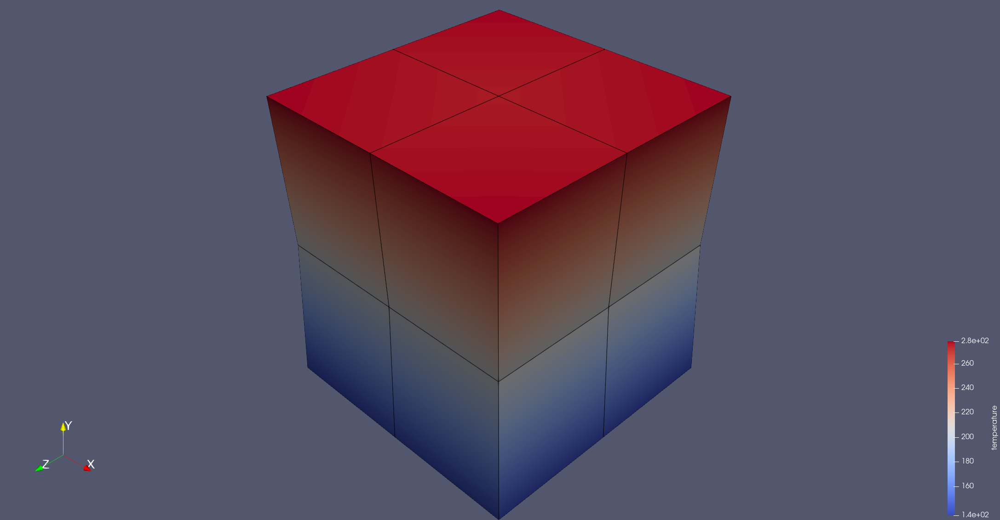
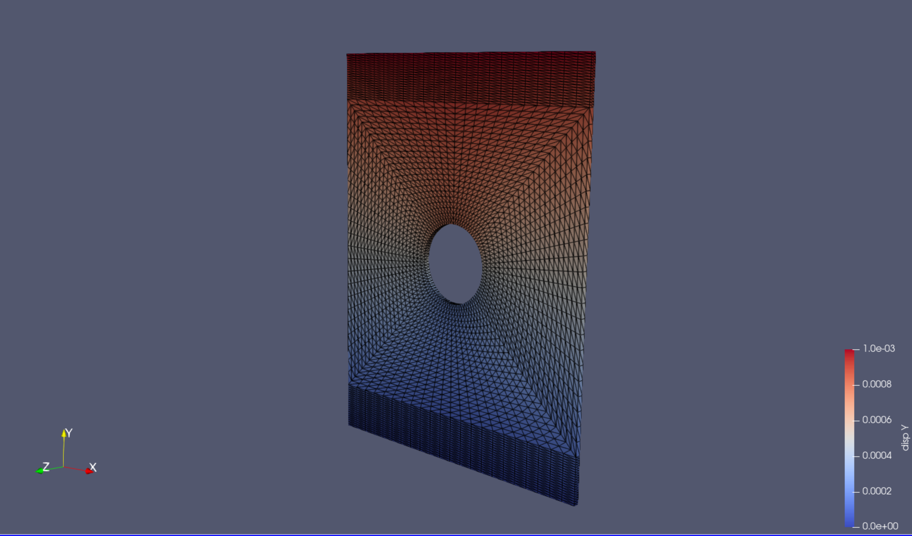

# Image Benchmarks
A set of physics-based imaging benchmarks for testing the speed of simulating digital image correlation and infrared thermography using `pyvale`.

## Usage
The benchmark cases are describes below and z case can be retrieved using its index in the case list or by using its string tag as follows:

```python
import imagebenchmarks as ib

(case_ident,case_mesh,case_camera) = ib.load_benchmark_by_index(case_index)
(case_ident,case_mesh,case_camera) = ib.load_benchmark_by_tag(case_tag)
```

The case list can also be retrieved using the following: `case_list = ib.load_case_list()`. The mesh data (nodal coordinates, connectivity table and field to render) for the case is stored as a `pyvale.CameraMesh` data class and the camera data for the case is stored as a `pyvale.CameraData` data class. Each `pyvale.CameraData.field_to_render` contains 8 time steps to render along with a zero frame at the start.

The benchmarks should be run as follows:
- Average render time for a single frame rendering the last field30 times sequentially. This case only allows parallelisation within a single frame.
- Average total time to render all 8 frames 30 times. This case allows for rendering the 8 frames in parallel.

## Case Descriptions
**Simulation: Simple Multi-Physics Cube**<br>
A 10mm cube undergoing thermo-mechanical loading as shown in the figure below. The cube is fixed on its bottom edge and the top edge is displaced 1mm in tension over 20 time steps. A heat flux is applied to the top surface and heat transfer coefficient is applied to the bottom surface inducing a temperature gradient in the same direction the is loaded mechanically. The displacement and temperature fields are output for all nodes. This simulation only contains a minimum number of elements for testing rendering algorithms on different element types including higher order elements. The mesh has 1 division per edge for tetrahedral and 2 divisions per edge for hexahedral resulting in a total of 24 3D elements per simulation. When the surface mesh is extracted there are 4 elements per face of the cube giving 24 surface elements for both tetrahedral and hexahedral meshes.

||
|:--:|
|*Paraview rendering of the cube test case for the tetrahedral mesh showing the temperature fieldpv.*|

**Simulation: Mechanical Plate**<br>
A 3D thin plate with a hole in the center loaded in tension as shown in the figure below. Uses tetrahedral 4-node linear elements with the surface mesh extracted to 3 node linear triangles. Higher order and quadrilateral meshes are included in the later benchmarks denoted: 'quadtri' for quadratic triangles, 'linquad' for linear quadrilaterals and 'quadquad' for quadratic quadrilaterals. The vertical displacement field `disp_y` is to be rendered as the image. Plate mesh bounding box: X [0,100], Y [0,130], Z [0,2] mm.

||
|:--:|
|*Paraview rendering of the plate test case for the coarsest mesh showing the vertical displacement field.*|

**Cameras**<br>
The following cameras form the benchmark list:
- "1Mpx" = 1280x960 pixels, pixel size = 5.3x5.3 micron
- "5Mpx" = 2464x2056 pixels, pixel size = 3.45x3.45 micron
- "24Mpx" = 5328x4608 pixels, pixel size = 2.74x2.74 micron

All cameras use a 50mm focal length lens. Two pixel subsampling (anti-aliasing) cases are analysed per camera: 1) 1 sample per pixel, 2) 2x2 subsamples per pixel.

**Camera Position**<br>
The camera is automatically positioned such that the center of the pixel array points at the center of the mesh. For the plate simulation the camera is rotated -30 degrees about the Y axis to view the plate at an angle.

The imaging distance is also automatically set based on the 'crop' / 'no crop' condition. For the 'crop' condition the camera is positioned to include 75% of the bounding box enclosing the mesh projected onto the camera viewing plane. For the no crop condition the camera is placed to include 105% of the bounding box enclosing the mesh projected onto the camera viewing plane (i.e. a 5% buffer is placed around the projected bounding box to ensure all elements are within the field of view).

## Case List
The list of all benchmark cases is stored in a json file which can be retrieved using the `imagebenchmark.get_case_list()` function. The current benchmark list is given below. Each benchmark uses
```json
[
    "case0_plate_lintri_1Mpx_1subsamp_nocrop_11776elems",
    "case1_plate_lintri_1Mpx_2subsamp_nocrop_11776elems",
    "case2_plate_lintri_1Mpx_1subsamp_crop_11776elems",
    "case3_plate_lintri_1Mpx_2subsamp_crop_11776elems",
    "case4_plate_lintri_5Mpx_1subsamp_nocrop_11776elems",
    "case5_plate_lintri_5Mpx_2subsamp_nocrop_11776elems",
    "case6_plate_lintri_5Mpx_1subsamp_crop_11776elems",
    "case7_plate_lintri_5Mpx_2subsamp_crop_11776elems",
    "case8_plate_lintri_24Mpx_1subsamp_nocrop_11776elems",
    "case9_plate_lintri_24Mpx_2subsamp_nocrop_11776elems",
    "case10_plate_lintri_24Mpx_1subsamp_crop_11776elems",
    "case11_plate_lintri_24Mpx_2subsamp_crop_11776elems",
    "case12_plate_lintri_1Mpx_1subsamp_nocrop_65296elems",
    "case13_plate_lintri_1Mpx_2subsamp_nocrop_65296elems",
    "case14_plate_lintri_1Mpx_1subsamp_crop_65296elems",
    "case15_plate_lintri_1Mpx_2subsamp_crop_65296elems",
    "case16_plate_lintri_5Mpx_1subsamp_nocrop_65296elems",
    "case17_plate_lintri_5Mpx_2subsamp_nocrop_65296elems",
    "case18_plate_lintri_5Mpx_1subsamp_crop_65296elems",
    "case19_plate_lintri_5Mpx_2subsamp_crop_65296elems",
    "case20_plate_lintri_24Mpx_1subsamp_nocrop_65296elems",
    "case21_plate_lintri_24Mpx_2subsamp_nocrop_65296elems",
    "case22_plate_lintri_24Mpx_1subsamp_crop_65296elems",
    "case23_plate_lintri_24Mpx_2subsamp_crop_65296elems",
    "case24_plate_lintri_1Mpx_1subsamp_nocrop_250496elems",
    "case25_plate_lintri_1Mpx_2subsamp_nocrop_250496elems",
    "case26_plate_lintri_1Mpx_1subsamp_crop_250496elems",
    "case27_plate_lintri_1Mpx_2subsamp_crop_250496elems",
    "case28_plate_lintri_5Mpx_1subsamp_nocrop_250496elems",
    "case29_plate_lintri_5Mpx_2subsamp_nocrop_250496elems",
    "case30_plate_lintri_5Mpx_1subsamp_crop_250496elems",
    "case31_plate_lintri_5Mpx_2subsamp_crop_250496elems",
    "case32_plate_lintri_24Mpx_1subsamp_nocrop_250496elems",
    "case33_plate_lintri_24Mpx_2subsamp_nocrop_250496elems",
    "case34_plate_lintri_24Mpx_1subsamp_crop_250496elems",
    "case35_plate_lintri_24Mpx_2subsamp_crop_250496elems",
    "case36_plate_linquad_1Mpx_1subsamp_nocrop_5888elems",
    "case37_plate_linquad_1Mpx_2subsamp_nocrop_5888elems",
    "case38_plate_linquad_1Mpx_1subsamp_crop_5888elems",
    "case39_plate_linquad_1Mpx_2subsamp_crop_5888elems",
    "case40_plate_linquad_5Mpx_1subsamp_nocrop_5888elems",
    "case41_plate_linquad_5Mpx_2subsamp_nocrop_5888elems",
    "case42_plate_linquad_5Mpx_1subsamp_crop_5888elems",
    "case43_plate_linquad_5Mpx_2subsamp_crop_5888elems",
    "case44_plate_linquad_24Mpx_1subsamp_nocrop_5888elems",
    "case45_plate_linquad_24Mpx_2subsamp_nocrop_5888elems",
    "case46_plate_linquad_24Mpx_1subsamp_crop_5888elems",
    "case47_plate_linquad_24Mpx_2subsamp_crop_5888elems",
    "case48_plate_quadtri_1Mpx_1subsamp_nocrop_11776elems",
    "case49_plate_quadtri_1Mpx_2subsamp_nocrop_11776elems",
    "case50_plate_quadtri_1Mpx_1subsamp_crop_11776elems",
    "case51_plate_quadtri_1Mpx_2subsamp_crop_11776elems",
    "case52_plate_quadtri_5Mpx_1subsamp_nocrop_11776elems",
    "case53_plate_quadtri_5Mpx_2subsamp_nocrop_11776elems",
    "case54_plate_quadtri_5Mpx_1subsamp_crop_11776elems",
    "case55_plate_quadtri_5Mpx_2subsamp_crop_11776elems",
    "case56_plate_quadtri_24Mpx_1subsamp_nocrop_11776elems",
    "case57_plate_quadtri_24Mpx_2subsamp_nocrop_11776elems",
    "case58_plate_quadtri_24Mpx_1subsamp_crop_11776elems",
    "case59_plate_quadtri_24Mpx_2subsamp_crop_11776elems",
    "case60_plate_quadquad_1Mpx_1subsamp_nocrop_5888elems",
    "case61_plate_quadquad_1Mpx_2subsamp_nocrop_5888elems",
    "case62_plate_quadquad_1Mpx_1subsamp_crop_5888elems",
    "case63_plate_quadquad_1Mpx_2subsamp_crop_5888elems",
    "case64_plate_quadquad_5Mpx_1subsamp_nocrop_5888elems",
    "case65_plate_quadquad_5Mpx_2subsamp_nocrop_5888elems",
    "case66_plate_quadquad_5Mpx_1subsamp_crop_5888elems",
    "case67_plate_quadquad_5Mpx_2subsamp_crop_5888elems",
    "case68_plate_quadquad_24Mpx_1subsamp_nocrop_5888elems",
    "case69_plate_quadquad_24Mpx_2subsamp_nocrop_5888elems",
    "case70_plate_quadquad_24Mpx_1subsamp_crop_5888elems",
    "case71_plate_quadquad_24Mpx_2subsamp_crop_5888elems",
    "case72_cube_TET4_1Mpx_1subsamp_nocrop_24elems",
    "case73_cube_TET4_1Mpx_2subsamp_nocrop_24elems",
    "case74_cube_TET4_1Mpx_1subsamp_crop_24elems",
    "case75_cube_TET4_1Mpx_2subsamp_crop_24elems",
    "case76_cube_TET4_5Mpx_1subsamp_nocrop_24elems",
    "case77_cube_TET4_5Mpx_2subsamp_nocrop_24elems",
    "case78_cube_TET4_5Mpx_1subsamp_crop_24elems",
    "case79_cube_TET4_5Mpx_2subsamp_crop_24elems",
    "case80_cube_TET4_24Mpx_1subsamp_nocrop_24elems",
    "case81_cube_TET4_24Mpx_2subsamp_nocrop_24elems",
    "case82_cube_TET4_24Mpx_1subsamp_crop_24elems",
    "case83_cube_TET4_24Mpx_2subsamp_crop_24elems",
    "case84_cube_TET10_1Mpx_1subsamp_nocrop_24elems",
    "case85_cube_TET10_1Mpx_2subsamp_nocrop_24elems",
    "case86_cube_TET10_1Mpx_1subsamp_crop_24elems",
    "case87_cube_TET10_1Mpx_2subsamp_crop_24elems",
    "case88_cube_TET10_5Mpx_1subsamp_nocrop_24elems",
    "case89_cube_TET10_5Mpx_2subsamp_nocrop_24elems",
    "case90_cube_TET10_5Mpx_1subsamp_crop_24elems",
    "case91_cube_TET10_5Mpx_2subsamp_crop_24elems",
    "case92_cube_TET10_24Mpx_1subsamp_nocrop_24elems",
    "case93_cube_TET10_24Mpx_2subsamp_nocrop_24elems",
    "case94_cube_TET10_24Mpx_1subsamp_crop_24elems",
    "case95_cube_TET10_24Mpx_2subsamp_crop_24elems",
    "case96_cube_HEX8_1Mpx_1subsamp_nocrop_24elems",
    "case97_cube_HEX8_1Mpx_2subsamp_nocrop_24elems",
    "case98_cube_HEX8_1Mpx_1subsamp_crop_24elems",
    "case99_cube_HEX8_1Mpx_2subsamp_crop_24elems",
    "case100_cube_HEX8_5Mpx_1subsamp_nocrop_24elems",
    "case101_cube_HEX8_5Mpx_2subsamp_nocrop_24elems",
    "case102_cube_HEX8_5Mpx_1subsamp_crop_24elems",
    "case103_cube_HEX8_5Mpx_2subsamp_crop_24elems",
    "case104_cube_HEX8_24Mpx_1subsamp_nocrop_24elems",
    "case105_cube_HEX8_24Mpx_2subsamp_nocrop_24elems",
    "case106_cube_HEX8_24Mpx_1subsamp_crop_24elems",
    "case107_cube_HEX8_24Mpx_2subsamp_crop_24elems",
    "case108_cube_HEX20_1Mpx_1subsamp_nocrop_24elems",
    "case109_cube_HEX20_1Mpx_2subsamp_nocrop_24elems",
    "case110_cube_HEX20_1Mpx_1subsamp_crop_24elems",
    "case111_cube_HEX20_1Mpx_2subsamp_crop_24elems",
    "case112_cube_HEX20_5Mpx_1subsamp_nocrop_24elems",
    "case113_cube_HEX20_5Mpx_2subsamp_nocrop_24elems",
    "case114_cube_HEX20_5Mpx_1subsamp_crop_24elems",
    "case115_cube_HEX20_5Mpx_2subsamp_crop_24elems",
    "case116_cube_HEX20_24Mpx_1subsamp_nocrop_24elems",
    "case117_cube_HEX20_24Mpx_2subsamp_nocrop_24elems",
    "case118_cube_HEX20_24Mpx_1subsamp_crop_24elems",
    "case119_cube_HEX20_24Mpx_2subsamp_crop_24elems",
    "case120_cube_HEX27_1Mpx_1subsamp_nocrop_24elems",
    "case121_cube_HEX27_1Mpx_2subsamp_nocrop_24elems",
    "case122_cube_HEX27_1Mpx_1subsamp_crop_24elems",
    "case123_cube_HEX27_1Mpx_2subsamp_crop_24elems",
    "case124_cube_HEX27_5Mpx_1subsamp_nocrop_24elems",
    "case125_cube_HEX27_5Mpx_2subsamp_nocrop_24elems",
    "case126_cube_HEX27_5Mpx_1subsamp_crop_24elems",
    "case127_cube_HEX27_5Mpx_2subsamp_crop_24elems",
    "case128_cube_HEX27_24Mpx_1subsamp_nocrop_24elems",
    "case129_cube_HEX27_24Mpx_2subsamp_nocrop_24elems",
    "case130_cube_HEX27_24Mpx_1subsamp_crop_24elems",
    "case131_cube_HEX27_24Mpx_2subsamp_crop_24elems"
]
```
